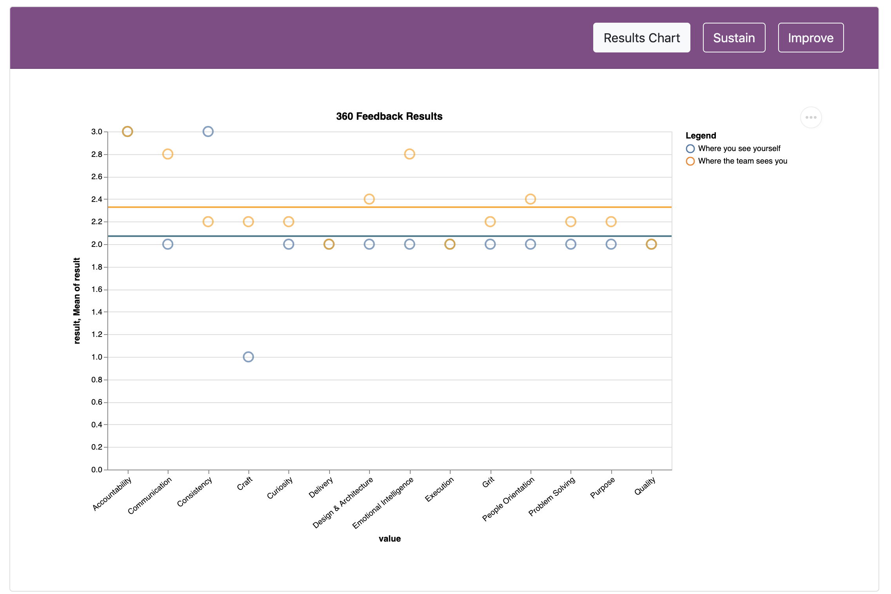

# Work Automation

A repo to hold various pieces of ad-hoc workplace automation

## Contents

 - [Slack Standup Bot](#slack-standup-bot)
 - [Three Sixty](#three-sixty)

## Slack Standup Bot

This bot picks a random member of the team to run standup Tuesday to Friday each week and posts the selection to a designated team channel. It is setup to run in [google app scripts](https://script.google.com) and uses a google sheet as a pseudo database.

In order to run properly is required the following Script Properties to be specified:

 - `SLACK_INCOMING_URL` The url for a slack incoming webhook.
 - `SPREADSHEET_ID` The id of the google sheet holding all the team members names
 - `SLACK_CHANNEL_NAME` The name of the channel to publish message to
 - `CALENDAR_NAME` The name of the team calendar. Used to try and work out when team members are out of office
 - `STANDUP_EVENT_NAME` The name of the standup event in your calendar. Used to ensure that no message is not sent on a day when there is no standup

The script can be setup programattically by running `createTriggers`. Or individual triggers can be created as needed using the app scripts GUI.

## Three Sixty

:construction: Under :construction: Ongoing :construction: Construction :construction:

This is a related set of google app scripts that are designed to provide a full three sixty degree feedback application.

The consituent parts are as follows:

 - A Self Evaluation Survey (Google Form). This is sent to the individual and is currently configured manually. The aspiration is for the to be configured programmatically in the future. An example can be seen [here](https://docs.google.com/forms/d/1uxLmmoWuYvA-V1I1JTmVvREYgepOwuSCe1Pf4YLaPpM/edit?usp=sharing)
 - A Team Feedback Survey (Google Form). This is sent to every other member of the team and is currently configured manually. The aspiration is for this to be configured programmatically in the future. An example can be seen [here](https://docs.google.com/forms/d/1XmHM3Wh5q3K7YdXHr7x86OsYpd_HootmoVgFf3KsQn8/edit?usp=sharing)
 - `three-sixty` The frontend that can serach for and display the results of a named team members feedback
 - `three-sixty-distribution` A frontend that automates the distribution of a round of three sixty feedback within a team. Emailing each team members their own feedback form and then the team feedback form for all of their other team members.

